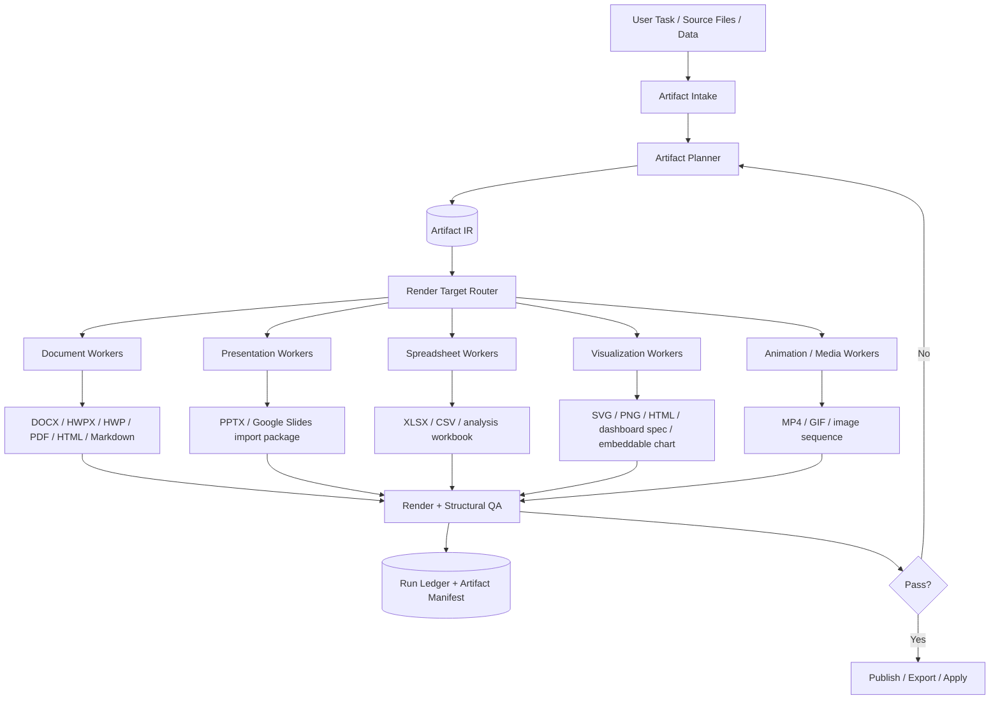

# PRD: Nanus Artifact Studio for Documents, Presentations, Spreadsheets, and Visualizations

Created: 2026-06-30T00:51:00Z
Status: Extension plan ready for execution handoff

## Product Goal

Add an Artifact Studio to Nanus: a controlled authoring system that can produce high-quality documents, decks, spreadsheets, dashboards, diagrams, charts, maps, animations, and Korean office formats from tasks, source files, data, and agent-generated analysis.

This must not be a loose pile of exporters. The core is a normalized Artifact IR that lets Nanus plan, generate, render, verify, revise, and export artifacts across formats while preserving provenance and safety.

## Core Decision

Build Artifact Studio as a new capability family behind the existing Worker Adapter Gateway.

- Control plane: TypeScript-first, same as the approved Nanus plan.
- Canonical event stream: existing `snake_case` `WorkerEventEnvelope`.
- Artifact truth: run ledger plus artifact manifest.
- Authoring kernel: `ArtifactPlan` + `Block` + `DataBinding` + `RenderTarget` + `QAReport`.
- Engines: integrated through adapters, not hardwired into the orchestrator.

## Why This Shape

Generating a good PPT, DOCX, HWPX, dashboard, or chart requires different engines, but the process is the same:

1. Understand intent and audience.
2. Build a structured artifact plan.
3. Bind data and sources.
4. Render or export.
5. Inspect visually and structurally.
6. Revise until verification passes.
7. Publish with provenance.

The stable product boundary should be the artifact lifecycle, not any one generator.

## Architecture



## Artifact IR

The IR should be narrow and explicit:

```ts
interface ArtifactPlan {
  artifact_id: string;
  artifact_type: "document" | "presentation" | "spreadsheet" | "dashboard" | "diagram" | "map" | "animation" | "mixed";
  audience: string;
  purpose: string;
  style_profile: StyleProfile;
  blocks: ArtifactBlock[];
  data_bindings: DataBinding[];
  sources: SourceRef[];
  render_targets: RenderTarget[];
  qa_requirements: QARequirement[];
}

interface ArtifactBlock {
  block_id: string;
  role: "title" | "section" | "prose" | "table" | "chart" | "diagram" | "image" | "code" | "callout" | "workflow" | "appendix";
  content: unknown;
  layout_intent?: LayoutIntent;
  source_refs?: string[];
}

interface RenderTarget {
  target_id: string;
  format: "pptx" | "docx" | "xlsx" | "hwpx" | "hwp" | "pdf" | "html" | "markdown" | "svg" | "png" | "mp4";
  engine_preference?: string[];
  verification_profile: "visual" | "structural" | "formula" | "interactive" | "video" | "mixed";
}
```

Persisted manifests and API payloads use `snake_case`, matching the approved Nanus event schema.

## Engine Strategy

### Presentation Workers

Use two primary paths:

- `presenton/presenton`: API-first deck generation and web product surface. Strong fit for Nanus service integration because it is TypeScript and Apache-2.0.
- `hugohe3/ppt-master`: high-quality editable PPTX generation, native shapes/animations, template-following, narration/speaker notes. Strong fit as a specialized worker.

Nanus should treat both as presentation engines behind the same adapter:

```ts
interface PresentationWorker {
  plan_deck(input: ArtifactPlan): Promise<DeckPlan>;
  render_pptx(plan: DeckPlan, policy: RunPolicy): AsyncIterable<WorkerEventEnvelope>;
  inspect_pptx(path: string): Promise<QAReport>;
}
```

Routing:

- Template-following deck: prefer `ppt-master`.
- API/web deck generation: prefer Presenton.
- Precise enterprise template or post-editing: internal PPTX adapter plus render QA.

### Document Workers

Use a layered model:

- `docling-project/docling`: source ingestion and document understanding for PDFs, office files, and AI-ready extraction.
- `beautiful-docs` and `The-Documentation-Compendium`: documentation pattern library, README/manual/SOP template inspiration; use as content templates, not runtime code.
- `WritingTools`: writing/editing UX inspiration and optional separate grammar assistant connector due GPL-3.0.
- `ONLYOFFICE/documentserver`: optional collaborative editor service, not embedded core due AGPL-3.0.
- HWP/HWPX:
  - `python-hwpx`: HWPX read/edit/generate/validate path.
  - `unhwp`: HWP/HWPX conversion to Markdown/plain text/JSON.
  - `hwplib`: Java HWP support for deeper legacy HWP workflows.

Document routing:

- Import/understand: Docling first.
- Generate DOCX/Markdown/HTML/PDF: internal document worker.
- Generate/edit HWPX: python-hwpx first.
- Convert legacy HWP to Markdown/JSON: unhwp first.
- Deep Java HWP operations: hwplib as an optional sidecar.
- Collaborative live editing: ONLYOFFICE as external service adapter.

### Visualization Workers

Use a chart-spec-first architecture:

- `microsoft/data-formulator`: AI-assisted data transformation + visual exploration UI.
- `microsoft/lida`: LLM-driven visualization/infographic suggestion engine.
- `pygwalker`: dataframe exploration and interactive analysis UI.
- `ECharts`: default browser chart renderer for dashboards and embeddable charts.
- `plotly.js`: interactive scientific/analytical charts where Plotly trace semantics are stronger.
- `mermaid`: text-based flowcharts, sequence diagrams, architecture diagrams.
- `xyflow`: node-based workflow/editor UI.
- `cytoscape.js`: graph/network visualization and analysis.
- `chartdb`: database diagrams as external/service/reference due AGPL-3.0.
- `kepler.gl`: geospatial visualization.
- `manim`: mathematical and explanatory animations.
- `metabase`: external BI connector/service, not embedded core until license review.

Nanus should normalize generated visualization specs:

```ts
type VisualizationSpec =
  | { kind: "echarts"; option: unknown }
  | { kind: "plotly"; data: unknown[]; layout: unknown }
  | { kind: "mermaid"; code: string }
  | { kind: "xyflow"; nodes: unknown[]; edges: unknown[] }
  | { kind: "cytoscape"; elements: unknown[]; style?: unknown }
  | { kind: "kepler"; config: unknown; datasets: unknown[] }
  | { kind: "manim"; scene_source: string };
```

Routing:

- Business dashboards: ECharts first, Plotly when analytical interactivity matters.
- Flow/architecture diagrams: Mermaid first; XYFlow when editable node UI is needed.
- Network/knowledge graph: Cytoscape.
- Database schema: ChartDB adapter or internal Mermaid/ERD fallback.
- Geo: Kepler.
- Math/explainer animation: Manim.
- Data exploration: Data Formulator/PyGWalker/LIDA as assistant workers, then export a stable spec.

### Spreadsheet Workers

Use multiple engines by task:

- `exceljs`: TypeScript-first XLSX generation/editing for Nanus core.
- `openpyxl`: Python read/write and formula-preserving operations.
- `XlsxWriter`: deterministic XLSX creation with strong formatting/chart writing.
- `pyexcel`: broad file format import/export and table normalization.

Routing:

- Core TypeScript artifact worker: exceljs.
- Formula-preserving edit/import: openpyxl.
- High-control generated XLSX report: XlsxWriter.
- Multi-format tabular conversion: pyexcel.

## UI: Artifact Studio

Artifact Studio should be an operational workspace, not a landing page:

- Left: source files, data tables, prompts, references.
- Center: live artifact preview.
- Right: artifact outline, style profile, QA issues, export targets.
- Bottom: event stream, provenance, render history, errors.

Required views:

- Document editor/preview.
- Deck outline and slide preview.
- Spreadsheet grid and chart preview.
- Visualization canvas.
- Diagram/workflow editor.
- Export package view.

## Worker Events

Add artifact-specific events to the existing Nanus event taxonomy:

- `artifact.plan.created`
- `artifact.source.ingested`
- `artifact.block.generated`
- `artifact.data.bound`
- `artifact.render.started`
- `artifact.render.completed`
- `artifact.qa.started`
- `artifact.qa.issue`
- `artifact.qa.completed`
- `artifact.export.completed`
- `artifact.publish.requested`
- `artifact.publish.completed`
- `artifact.publish.failed`

All events use the canonical `WorkerEventEnvelope` with `snake_case`.

## Artifact Manifest

Every generated output has a manifest:

```ts
interface ArtifactManifest {
  artifact_id: string;
  run_id: string;
  artifact_type: string;
  outputs: ArtifactOutput[];
  source_refs: SourceRef[];
  engine_refs: EngineRef[];
  qa_reports: QAReport[];
  license_notes: LicenseNote[];
  redaction_status: "redacted" | "no_secrets_detected";
  created_at: string;
}
```

## Licensing and Embedding Rules

| Category | Repos | Rule |
| --- | --- | --- |
| Core-embeddable candidates | ppt-master, Presenton, Docling, python-hwpx, unhwp, Data Formulator, LIDA, PyGWalker, ECharts, Plotly.js, Mermaid, XYFlow, Cytoscape.js, Kepler.gl, Manim, XlsxWriter, pyexcel, exceljs | MIT/Apache/BSD style metadata; still pin versions and preserve notices. |
| Service adapter / license review | ONLYOFFICE DocumentServer, ChartDB | AGPL-3.0; run as separately deployed service only after legal/product decision. |
| Inspiration / optional connector | WritingTools | GPL-3.0; do not embed in core. |
| Reference templates | beautiful-docs, Documentation Compendium | Use as content/design inspiration with attribution; verify license before copying material. |
| External platform inspiration | Dify, Metabase | Use as integration/reference until license review resolves `NOASSERTION` metadata. |

## Implementation Plan

### Phase A: Artifact Core

- Add `packages/artifact-core`.
- Define Artifact IR, manifest, QA schema, engine registry, and render target routing.
- Add JSON Schema fixtures for `ArtifactPlan`, `ArtifactManifest`, and visualization specs.
- Add source provenance and license note structures.

Acceptance criteria:

- TypeScript types and JSON Schemas agree.
- Example artifact plans validate.
- Artifact events use existing `snake_case` envelope.

### Phase B: Document and Spreadsheet MVP

- Add `packages/artifact-workers-document`.
- Add `packages/artifact-workers-spreadsheet`.
- Implement Markdown/HTML/DOCX planning stubs, HWPX routing stub, Docling ingestion adapter stub.
- Implement XLSX generation adapter plan around exceljs first, with openpyxl/XlsxWriter as sidecar routes.

Acceptance criteria:

- Given a structured brief, worker produces an artifact manifest and a Markdown/HTML draft.
- XLSX worker can produce a simple workbook manifest with a chart target.
- HWPX import/export routes report capability/health even before full implementation.

### Phase C: Presentation MVP

- Add `packages/artifact-workers-presentation`.
- Presenton adapter: API/service route.
- ppt-master adapter: specialized deck render route.
- Add deck plan schema and PPTX QA event model.

Acceptance criteria:

- Deck plan can route to Presenton or ppt-master based on template-following and API needs.
- Generated deck artifacts require render/inspection QA before publish.

### Phase D: Visualization MVP

- Add `packages/artifact-workers-visualization`.
- Implement stable spec generators for Mermaid, ECharts, Plotly, Cytoscape, XYFlow, Kepler, and Manim.
- Use LIDA/Data Formulator/PyGWalker as assistant routes for exploration and recommendation, not direct truth.

Acceptance criteria:

- A data table can produce an ECharts spec and a PNG/SVG/HTML preview target.
- Architecture text can produce Mermaid.
- Network data can produce Cytoscape.
- Geospatial data can route to Kepler.
- Math animation request can route to Manim.

### Phase E: Artifact Studio UI

- Add Artifact Studio routes in `apps/web`.
- Add preview panes for document, deck, spreadsheet, visualization, and QA reports.
- Add export/publish flow with approval gate.

Acceptance criteria:

- User can generate, inspect, QA, and export at least Markdown/HTML, XLSX, Mermaid/ECharts, and PPTX route stubs.
- QA issues appear before publish.
- Provenance and license notes are visible.

### Phase F: Collaborative and Enterprise Integrations

- ONLYOFFICE service adapter.
- Metabase connector.
- ChartDB service connector.
- Google Docs/Slides/Sheets import/export connectors.
- HWP/HWPX deeper operations.

Acceptance criteria:

- AGPL/GPL/NOASSERTION components are isolated behind service boundaries or disabled by default.
- Legal/license status is visible in the engine registry.

## Verification Plan

- Unit: schema validation for ArtifactPlan, Manifest, QAReport, and visualization specs.
- Unit: routing tests select correct engine by artifact type, format, data shape, and policy.
- Unit: license policy prevents core embedding of AGPL/GPL/NOASSERTION engines.
- Integration: Docling ingestion fixture creates structured source blocks.
- Integration: Mermaid/ECharts/Plotly specs render to stable previews.
- Integration: XLSX worker creates workbook and inspection metadata.
- Integration: PPT route produces deck manifest and QA request.
- E2E: mixed artifact request creates a report + deck + chart bundle.
- Security: redaction applied before manifests and event streams.
- Visual QA: previews checked for blank/failed renders, clipped text, broken charts, and missing fonts.

## ADR

### Decision

Add Artifact Studio as an IR-first authoring layer behind Worker Adapter Gateway. Use the user-provided repositories as engine adapters, service connectors, or reference libraries based on capability and license fit.

### Drivers

- User wants Nanus to strongly produce documents, decks, spreadsheets, and visualizations.
- The artifact generation domain has many strong specialized tools; one engine cannot cover all formats well.
- Existing Nanus safety model already provides the right dispatch, ledger, redaction, and sandbox foundation.

### Alternatives Considered

- One giant document-generation service: rejected because PPT/DOCX/XLSX/HWPX/maps/animations require specialized engines.
- Directly embed every listed repo: rejected due licensing, runtime, and maintenance risks.
- UI-only integration with external tools: rejected because Nanus needs auditable generation and verification.

### Why Chosen

IR-first design gives Nanus one stable lifecycle while allowing engines to be swapped, added, isolated, or disabled.

### Consequences

- More upfront schema work.
- Stronger QA and provenance.
- Better long-term support for Korean office formats and visual analytics.
- License-aware architecture avoids contaminating the core with AGPL/GPL components.

### Follow-ups

- Use `.omx/specs/artifact-engine-registry-20260630T005100Z.json` as the first machine-readable engine registry fixture.
- Decide which presentation path to implement first: Presenton service or ppt-master sidecar.
- Decide whether HWPX generation is MVP or Phase F.
- Add render QA workers for DOCX/PPTX/XLSX/HTML/SVG/PNG.

## Recommended First Execution Scope

For the next implementation lane, do not implement every engine. Start with:

1. `packages/artifact-core`: IR, manifest, QA, engine registry, license policy.
2. `packages/artifact-workers-visualization`: Mermaid and ECharts spec workers.
3. `packages/artifact-workers-spreadsheet`: exceljs route stub and XLSX manifest.
4. `packages/artifact-workers-presentation`: Presenton/ppt-master capability manifests, no full render yet.
5. `packages/artifact-workers-document`: Docling/HWPX capability manifests and Markdown/HTML draft route.

This gives Nanus a strong artifact backbone before expensive engine integration.
