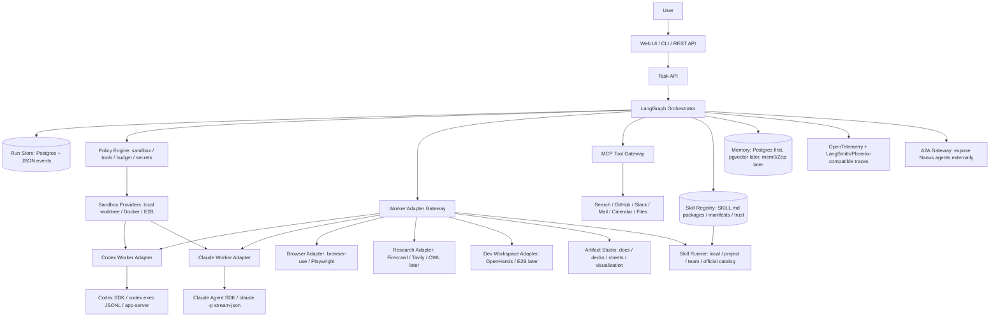
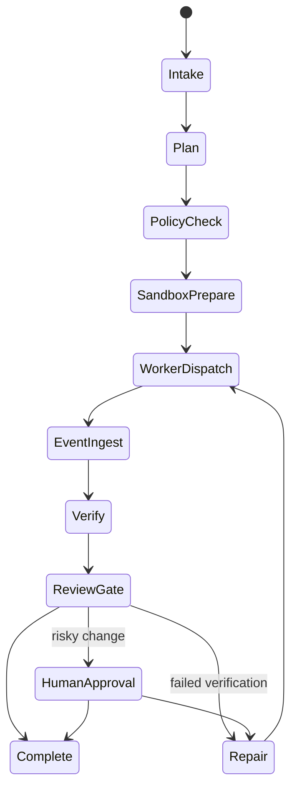

# PRD: Nanus SuperAgent Architecture with Claude Code and Codex Workers

Created: 2026-06-30T00:32:58Z
Status: Ralplan consensus approved
RALPLAN-DR mode: Deliberate, because worker execution, secrets, sandboxing, filesystem writes, MCP, and future A2A surfaces create security-sensitive architecture decisions.

## Product Goal

Build Nanus as a local-first autonomous agent platform that can plan, delegate, execute, verify, and explain multi-step software and research tasks. The first differentiator is not "more frameworks"; it is a reliable orchestration kernel that can connect Claude Code and Codex as controlled workers, capture their event streams, enforce sandbox policy, and preserve auditable artifacts.

First implementation stack: TypeScript-first control plane, API, web UI, shared schemas, and worker adapter interfaces. Python sidecars are allowed later only when a specific SDK/runtime is materially better in Python.

## Requirements Summary

- Provide a user-facing task surface: REST API first, then Web UI and CLI.
- Execute tasks through a Worker Adapter Gateway that supports Codex and Claude Code from day one.
- Keep all worker runs scoped to an explicit workspace, sandbox profile, budget, timeout, and tool policy.
- Persist run state, worker events, artifacts, diffs, verification outputs, and final decisions.
- Support model/provider substitution through worker manifests rather than hardcoded model assumptions.
- Use MCP for tools and A2A for exposing or consuming agent-to-agent capabilities, but do not require full A2A for the first local MVP.
- Add browser/research/OpenHands/OWL/mem0/Zep only after the worker gateway, run ledger, sandboxing, and verification loop are working.
- Add Artifact Studio as a Worker Adapter Gateway capability family for documents, presentations, spreadsheets, visualizations, diagrams, maps, animations, HWP/HWPX, and publishable artifact bundles. Detailed plan: `.omx/plans/prd-document-visual-authoring-20260630T005100Z.md`.
- Add Skill Hub as a first-class capability family for reusable skill packages, including local skills, generated skills, GitHub imports, project/team skill libraries, and official Manus-compatible skill catalog entries. Detailed plan: `.omx/specs/skill-system-registry-20260630T012253Z.json` and `.omx/plans/test-spec-skill-system-20260630T012253Z.md`.

## RALPLAN-DR Summary

### Principles

1. Local-first control: credentials, source, and run artifacts stay under user-controlled infrastructure by default.
2. Adapter boundary first: Claude Code, Codex, OpenHands, browser-use, and future agents are workers behind a stable contract.
3. Event-sourced auditability: every worker action becomes a typed event, artifact, or policy decision.
4. Least privilege by run: sandbox, tools, network, secrets, and filesystem access are selected per task.
5. Progressive capability: ship a thin, verifiable core before adding memory, wide research, and external agent marketplaces.

### Decision Drivers

1. Fast proof that Nanus can call Codex and Claude Code safely and collect useful outputs.
2. Avoid irreversible architecture coupling to one model, CLI, framework, or cloud provider.
3. Make verification, rollback, and human review part of the architecture rather than a later UI feature.

### Viable Options

| Option | Description | Pros | Cons |
| --- | --- | --- | --- |
| A. LangGraph-led core plus worker adapters | Use LangGraph for resumable task state, with a Worker Adapter Gateway for Codex, Claude, and future tools. | Best fit for long-running state, retries, checkpoints, human gates, and heterogeneous workers. | Requires careful event/schema design before adding many integrations. |
| B. OpenHands-first platform | Use OpenHands as the main developer runtime and wrap the rest around it. | Faster access to a mature coding-agent workspace and UI-like patterns. | Risks making Nanus a wrapper around one agent runtime rather than a general orchestration platform. |
| C. A2A-first agent marketplace | Make every component an A2A server/client from the start. | Strong interoperability story and clean cross-agent discovery. | Too much protocol surface for MVP; local Codex/Claude worker control is needed first. |
| D. CLI-only automation | Shell out to `codex exec` and `claude -p` from scripts with JSON parsing. | Fastest spike; minimum dependencies. | Hard to resume, secure, observe, and extend into a product without rebuilding the core. |

Favored path: Option A, with Option D as the first spike inside the adapter layer. This keeps the MVP small while preserving the path to SDK, app-server, MCP, A2A, Docker, and E2B.

## Target Architecture



## Core Design

### 1. Worker Adapter Gateway

Every external or internal agent runtime implements the same contract:

```ts
interface WorkerAdapter {
  id: string;
  capabilities(): WorkerCapabilities;
  health(): Promise<WorkerHealth>;
  startRun(input: WorkerRunInput): AsyncIterable<WorkerEvent>;
  resumeRun(input: WorkerResumeInput): AsyncIterable<WorkerEvent>;
  cancel(runId: string): Promise<void>;
  collectArtifacts(runId: string): Promise<WorkerArtifact[]>;
}
```

`WorkerRunInput` must include an immutable `RunPolicy` snapshot:

```ts
interface RunPolicy {
  runId: string;
  workspaceRoot: string;
  writableRoots: string[];
  sandboxMode: "read-only" | "workspace-write" | "disposable-full-access";
  networkMode: "deny" | "allowlist" | "open";
  allowedHosts: string[];
  mcpConfigRefs: string[];
  secretRefs: string[];
  timeoutMs: number;
  maxTurns?: number;
  maxBudgetUsd?: number;
}

interface WorkerEventEnvelope<T = unknown> {
  run_id: string;
  worker_id: string;
  sequence: number;
  timestamp: string;
  event_type: string;
  redaction_status: "raw_forbidden" | "redacted" | "no_secrets_detected";
  payload: T;
}
```

Canonical persisted and streamed event schema uses `snake_case`. TypeScript internals may expose camelCase helpers only behind explicit mappers; storage, API responses, WebSocket/SSE streams, JSONL fixtures, and test assertions must use the canonical `snake_case` envelope.

Adapter rules:

- A worker adapter may never mutate `RunPolicy` after dispatch.
- All events must be wrapped in the envelope before persistence or UI streaming.
- Resume must use either the worker's native resume token/thread ID or a Nanus idempotency key recorded in the run ledger.
- Artifacts must record provenance: worker, run ID, source event ID, path, checksum, and redaction status.

Minimum event types:

- `worker.started`
- `worker.stdout`
- `worker.stderr`
- `worker.reasoning.summary`
- `worker.tool.started`
- `worker.tool.completed`
- `worker.file.changed`
- `worker.patch.created`
- `worker.verification.started`
- `worker.verification.completed`
- `worker.completed`
- `worker.failed`
- `worker.cancelled`

### 2. Codex Connection Strategy

Use three progressively stronger paths:

1. MVP: `codex exec --json --sandbox workspace-write "<task>"` and parse JSONL events.
2. Product path: `@openai/codex-sdk` or `openai-codex` SDK for threads, resume, and sandbox presets.
3. Advanced local UI/control path: `codex app-server` over stdio or local authenticated WebSocket when the product needs interactive app-server semantics.

Local status: Codex CLI exists on this machine as `codex-cli 0.117.0`. The public docs show newer Codex releases exist, so first implementation should include a version check and compatibility matrix before relying on SDK/app-server features.

### 3. Claude Code Connection Strategy

Use two paths:

1. MVP after install: `claude -p --output-format stream-json --verbose --max-turns <N> --mcp-config ./mcp.json "<task>"`.
2. Product path: Claude Agent SDK in Python or TypeScript for direct programmatic control, built-in file/command/edit tools, and clearer permission configuration.

Local status: `claude` is not currently available on `PATH`; first implementation should detect this and show a setup task rather than failing mid-run.

### 4. Orchestrator Loop

Default task state machine:



### 5. Data Model

Minimum persistent entities:

- `Task`: user request, scope, owner, status.
- `Run`: execution attempt, selected worker, sandbox profile, budget, timeout.
- `WorkerEvent`: typed event stream from Codex/Claude/etc.
- `Artifact`: final response, patch, diff, logs, screenshots, reports.
- `PolicyDecision`: allowed/denied tools, command approvals, network policy, secret mounts.
- `Verification`: tests, lint, typecheck, manual review, eval score.
- `AgentManifest`: worker capabilities, cost hints, supported input/output modes, risk class.
- `SkillPackage`: source, manifest, `SKILL.md`, version, checksum, trust label, declared permissions, tests, and examples.
- `SkillInstallation`: scope, enabled state, owner, source ref, review state, rollback pointer, and policy defaults.
- `SkillInvocation`: slash command, resolved package version, worker mapping, inputs, outputs, run ID, and verification result.
- `SkillReview`: static checks, permission review, source trust, test result, and promotion decision.
- `ArtifactPlan`: normalized plan for document/deck/spreadsheet/visualization generation.
- `ArtifactManifest`: generated outputs, source references, engine references, QA reports, license notes, and redaction status.

### 6. Security Model

- No API key as a long-lived global env var for worker processes.
- Secrets are injected per run only into the child process or sandbox.
- Worker output is redacted before persistence and UI display.
- Default sandbox is read-only; editing requires `workspace-write`; full access is allowed only inside a disposable container or E2B sandbox.
- Each software task runs in an isolated git worktree or copied workspace.
- Network access is deny-by-default for code execution; allowlists are attached to the run policy.
- MCP servers are registered with scopes and a per-worker allowlist.
- A2A Agent Cards must not expose secrets or internal endpoints without authentication.
- Skills must never inherit broad worker permissions implicitly; every skill invocation receives a concrete `RunPolicy`.
- Official Manus skills are supported through public package sources, compatible exports, or user-provided packages only; Nanus must not bundle proprietary official skills without rights.
- Generated or imported skills start disabled until review, checksum, and optional disposable-workspace tests complete.

### Deliberate Pre-mortem

1. Secret leakage through worker logs or artifacts
   - Scenario: a worker prints environment variables, command output, or MCP credentials, and Nanus stores or streams the raw value.
   - Prevention: redaction before persistence/streaming, per-run secret refs, no global env inheritance by default, redaction status in every event envelope, secret safety E2E.
   - Detection: event redaction tests, fake-secret E2E, ledger audit sampling.

2. Unintended filesystem mutation
   - Scenario: Codex or Claude runs with write access and edits files outside the intended workspace or applies a patch directly to the main repo.
   - Prevention: isolated worktree/disposable workspace, writable root enforcement, patch promotion gate, read-only default, denial of full access unless disposable.
   - Detection: workspace boundary integration test, controlled edit E2E, git status checks before and after worker runs.

3. Split-brain recovery after restart
   - Scenario: LangGraph checkpoint and event ledger disagree, causing the orchestrator to replay or skip a dangerous action.
   - Prevention: run ledger is operator/audit truth, LangGraph owns only control-flow recovery, mismatch enters `manual_recovery_required`.
   - Detection: ledger/checkpoint conflict integration test and manual recovery E2E.

## Expanded Test Plan

- Unit: adapter contract, canonical `snake_case` event envelope, Codex parser, Claude parser, redaction, policy engine, state authority conflict handling.
- Integration: Codex read-only smoke, Codex workspace-write fixture, Claude health/mocked stream, API run lifecycle, dev ledger replay, MCP startup failure, network deny-by-default.
- E2E: operational task, controlled edit with patch promotion gate, manual recovery, missing Claude binary, secret safety.
- Observability: trace ID per run, ordered event sequences, policy decision visibility, bounded failure excerpts, redaction status on every stored/streamed event.

### 7. State Authority Model

Nanus has three state surfaces, and they must not compete:

- LangGraph checkpoints own orchestration control-flow recovery only: current node, retry state, human-gate position, and graph-local scratch state.
- Run ledger owns append-only operator/audit truth: worker events, artifacts, policy decisions, verification results, diffs, and final task status.
- Memory owns advisory context only: user preferences, reusable facts, and retrieval context. During MVP, memory must not make autonomous execution decisions and may be disabled entirely.

Recovery rule: after process restart, the API reconstructs operator-visible state from the run ledger, then uses LangGraph checkpoints only to decide the next legal orchestration transition. If the two disagree, the run ledger wins for audit truth and the orchestrator moves to a manual recovery state.

Manual recovery rule: `manual_recovery_required` freezes automatic worker dispatch, shows the ledger/checkpoint mismatch, and offers only explicit operator actions: mark failed, resume from a selected ledger event, retry in a new run, or archive with notes.

Patch promotion rule: write-capable worker output remains an artifact until an operator or approved policy applies it to the target workspace. MVP promotion uses a diff preview plus verification result; no worker applies patches directly to the main workspace without this gate.

## Implementation Plan

### Phase 0: Repository Bootstrap

Create the project skeleton and developer loop:

- `apps/api`: TypeScript orchestration API.
- `apps/web`: TypeScript operational dashboard.
- `packages/agent-core`: shared schemas and adapter interface.
- `packages/workers-codex`: Codex adapter.
- `packages/workers-claude`: Claude adapter.
- `packages/sandbox`: local worktree, Docker, future E2B providers.
- `packages/mcp-gateway`: MCP config registry and tool policy.
- `docs/architecture`: diagrams, ADRs, threat model.

Acceptance criteria:

- `README.md` explains local setup and first run.
- `npm test` or equivalent root command runs contract tests.
- The repo has a single command to start API and web in dev mode.

### Phase 1: CLI Worker Spike

Implement the Worker Adapter contract with CLI execution and the minimum safety gate:

- Codex adapter using `codex exec --json`.
- Claude adapter using `claude -p --output-format stream-json` when installed, otherwise health check reports `missing_binary`.
- JSONL/stream parser that normalizes both into `WorkerEvent`.
- Per-run timeout, cancellation, stdout/stderr capture, and final artifact extraction.
- Isolated worktree or disposable fixture workspace before any write-capable run.
- Immutable per-run `RunPolicy` snapshot.
- Redaction on ingest before persistence or UI streaming.
- Explicit network mode per run.
- Denial of `workspace-write` outside approved writable roots.
- Minimal file-backed dev ledger under `.nanus/runs/<runId>/events.jsonl` and `.nanus/runs/<runId>/artifacts/`, later replaced by Postgres in Phase 2 without changing event schemas.

Acceptance criteria:

- A local task can dispatch to Codex and persist normalized events.
- Claude health check reports actionable setup when CLI is absent.
- Failed process exits produce `worker.failed` with exit code and stderr excerpt.
- No worker event is persisted or streamed without the event envelope and redaction status.
- Write-capable runs fail closed unless the isolated workspace and writable roots are configured.
- Dev ledger replay can reconstruct a completed or failed Phase 1 run.

### Phase 2: Orchestration and Run Ledger

Add the LangGraph-based task loop and persistent run store:

- Task intake.
- Worker selection based on capability manifest.
- Sandbox/profile selection.
- Event ingestion.
- Verification step.
- Final task summary.

Acceptance criteria:

- API exposes `POST /tasks`, `GET /tasks/:id`, `GET /runs/:id/events`.
- A task can survive API restart if using persistent storage.
- Run ledger shows worker, sandbox, policy, events, artifacts, and verification result.

### Phase 3: Web UI

Build an operational UI, not a marketing page:

- Task composer.
- Worker selector and sandbox profile.
- Live event stream.
- Artifacts/diff panel.
- Verification panel.
- Approval gate for risky operations.

Acceptance criteria:

- User can submit a task, watch events, inspect artifacts, and cancel a run.
- Text fits on mobile and desktop; event streams do not overlap controls.
- UI never displays raw secrets or unredacted env values.

### Phase 4: MCP Tool Gateway

Centralize tool access:

- Register MCP servers.
- Attach MCP config to worker runs.
- Enforce per-worker/per-task tool allowlists.
- Log MCP tool calls as worker events.

Acceptance criteria:

- A task can run with a strict MCP config.
- A denied tool call is logged as a policy decision.
- Required MCP server startup failure prevents the run from silently continuing.

### Phase 4.5: Skill Hub and Official Catalog Compatibility

Add reusable skill packaging and invocation:

- Skill package loader for `SKILL.md`-centered folders and archives.
- Generated skill path: create a draft skill from user intent or a previous successful run.
- Upload path: install from local folder, archive, or standalone `SKILL.md`.
- GitHub import path: install from repo path, branch/tag, release asset, or raw package URL.
- Official catalog adapter: represent official Manus-compatible skills as catalog entries only when a public package source or user-provided export exists.
- Project and team skill scopes with promotion workflow.
- Slash command resolver for `/skill-name` and source-qualified aliases such as `/manus:<name>` when installed.
- Permission and tool review before enabling or running a skill.
- Skill invocation events that use the canonical `snake_case` worker event envelope.

Acceptance criteria:

- A local `SKILL.md` package can be installed, reviewed, enabled, invoked, and disabled.
- A generated skill remains disabled until review passes.
- A GitHub import stores source ref, checksum, and version.
- Official catalog entries without package sources are visible as reference-only and cannot execute.
- Skill invocations appear in the run ledger with package version, trust label, permissions, worker mapping, and verification result.

### Phase 5: SDK and Sandbox Hardening

Replace or augment CLI execution where useful:

- Codex SDK for resumable threads and sandbox presets.
- Claude Agent SDK for programmatic control.
- Docker sandbox provider.
- E2B provider for cloud VM tasks.

Acceptance criteria:

- Worker adapters can choose CLI or SDK backend through config.
- Docker/E2B runs have isolated filesystem and bounded runtime.
- Patch artifacts can be exported without exposing sandbox internals.

### Phase 6: Browser, Research, Memory, A2A

Add higher-level Manus-like features after the core works:

- Browser automation adapter: browser-use/Playwright.
- Research adapter: Firecrawl/Tavily/OWL-style fanout.
- Memory: Postgres first, pgvector; mem0/Zep only when product behavior needs cross-session personalization.
- A2A gateway: publish Nanus Agent Cards and accept external A2A tasks.
- Artifact Studio: add the IR-first document/deck/spreadsheet/visualization authoring layer described in `.omx/plans/prd-document-visual-authoring-20260630T005100Z.md`. The first implementation should start with artifact-core, Mermaid/ECharts, XLSX route stubs, document route stubs, and presentation engine manifests before full engine embedding.

Acceptance criteria:

- Each new capability is just another worker/tool adapter, not a special path through the system.
- A2A cards describe capabilities and auth without leaking secrets.
- Memory writes are explainable, inspectable, and deletable.
- Artifact outputs have manifests, source refs, QA reports, and license notes before publish.

## Risks and Mitigations

| Risk | Impact | Mitigation |
| --- | --- | --- |
| Worker CLIs change JSON/event shape | Adapters break | Version check, contract tests, fixture-based parsers, SDK backend option. |
| Credential leakage through logs | Severe | Per-run env injection, redaction middleware, no global key env, secret scanner tests. |
| Overbuilding with too many frameworks | Delivery stalls | MVP gates: Codex/Claude adapters, run ledger, sandbox, verification before OpenHands/OWL/mem0/Zep. |
| Worker runs modify unintended files | Data loss | Isolated worktree/container, explicit writable roots, patch review gate. |
| A2A/MCP expands attack surface | Security risk | Treat both as policy-controlled integration layers; deny-by-default scopes. |
| Claude CLI absent locally | Poor first-run UX | Health check reports setup state; Codex path remains usable. |
| Artifact engines introduce license/runtime risk | Legal or deployment risk | Use Artifact Studio engine registry; AGPL/GPL/NOASSERTION projects are service adapters or blocked until reviewed. |
| Imported skills run unsafe instructions | Security or data loss | Disable by default, require permission review, sandbox every invocation, and test in disposable workspace before promotion. |
| Official Manus skill access is unclear | Product confusion | Treat official entries as catalog references unless a public package source, compatible export, or user-provided package exists. |

## Verification Steps

- Unit: parse Codex JSONL fixtures and Claude stream-json fixtures.
- Unit: adapter contract conformance for success, failure, timeout, cancel, missing binary.
- Unit: redaction removes known secret patterns before persistence.
- Integration: run Codex in read-only mode and workspace-write mode on a fixture repo.
- Integration: run Claude adapter in mocked CLI mode until local binary is installed.
- Integration: create task through API and stream events through WebSocket/SSE.
- Security: verify denied commands/tools create policy events and do not execute.
- E2E: submit "inspect repo and summarize" task, receive final artifact, verify no unexpected file changes.
- Artifact: verify ArtifactPlan/ArtifactManifest schemas, engine routing, license policy, render QA, and publish gate using `.omx/plans/test-spec-document-visual-authoring-20260630T005100Z.md`.
- Skill: verify SkillPackage/SkillInstallation/SkillInvocation schemas, upload/GitHub/generated flows, official catalog reference-only behavior, permission review, slash command resolution, and run ledger integration using `.omx/plans/test-spec-skill-system-20260630T012253Z.md`.

## ADR

### Decision

Use a LangGraph-led orchestration core with a Worker Adapter Gateway. Codex and Claude Code are first-class workers, not special-case controllers. Start with CLI adapters and normalized event streams; add SDK/app-server and cloud sandboxes after the run ledger and sandbox policy are working.

### Drivers

- The user explicitly wants this architecture and wants Claude Code/Codex connected.
- Official docs for both Codex and Claude expose automation-friendly interfaces.
- The empty repo makes this a greenfield architecture, so the stable boundary should be the adapter contract and event schema.
- Architect review identified state authority and Phase 1 security sequencing as the critical correctness risks.

### Alternatives Considered

- OpenHands as the core: rejected for MVP because it narrows the platform around one developer-runtime abstraction.
- A2A-first: rejected for MVP because local worker control, audit logs, and sandbox policy are more urgent.
- CLI-only scripts: rejected as final architecture because they do not give durable state, policy, or product-grade observability.

### Why Chosen

This structure lets Nanus immediately use local Codex, add Claude once installed, and later plug in OpenHands, browser-use, Firecrawl, OWL, E2B, MCP, and A2A without changing the orchestration core.

LangGraph is intentionally constrained: it coordinates orchestration transitions, but the run ledger remains the operator-facing audit truth. This avoids split-brain recovery while preserving long-running workflow support.

### Consequences

- More upfront schema work is required.
- Early feature scope must stay disciplined.
- The platform can become stronger than a single closed agent mainly through control, auditability, data ownership, custom adapters, and verifiable execution rather than raw model claims.
- The first worker spike is slightly slower because redaction, policy snapshotting, and isolated workspace checks are mandatory before real writes.

### Follow-ups

- Install or configure Claude Code/Claude Agent SDK.
- Check Codex local version compatibility with desired SDK/app-server features.
- Draft the first WorkerEvent JSON Schema before writing adapters.
- For Artifact Studio, implement `.omx/plans/prd-document-visual-authoring-20260630T005100Z.md` after the base worker gateway/event/policy contracts exist.
- For Skill Hub, implement `.omx/specs/skill-system-registry-20260630T012253Z.json` and `.omx/plans/test-spec-skill-system-20260630T012253Z.md` after the base run ledger and policy contracts exist.

## Available Agent Types Roster

- `architect`: system boundaries, integration choices, threat model review.
- `critic`: plan quality gate and acceptance criteria validation.
- `executor`: scaffold and implement code.
- `dependency-expert`: SDK/package comparison and version checks.
- `security-reviewer`: secrets, sandbox, MCP/A2A auth, filesystem boundaries.
- `test-engineer`: adapter contract tests, integration fixtures, E2E verification.
- `verifier`: final evidence, run claims, installation checks.
- `designer`: operational UI layout and workflow design.
- `writer`: setup docs, ADRs, runbook.

## Follow-up Staffing Guidance

Recommended execution path: `$ultragoal` as durable owner plus `$team` for parallel implementation lanes.

- Lane 1, `executor`, high: scaffold repo, shared schemas, API skeleton.
- Lane 2, `executor`, high: Codex adapter and event parser.
- Lane 3, `executor`, high: Claude adapter health check and mocked stream parser.
- Lane 4, `test-engineer`, medium: contract fixtures and integration tests.
- Lane 5, `security-reviewer`, medium: secret redaction, sandbox policy, threat model.
- Lane 6, `designer`, high: operational dashboard only after API/event stream exists.
- Lane 7, `executor`, medium: Skill Hub package loader, slash command resolver, and registry UI stubs after policy/run ledger contracts exist.

Use `$ralph` only as an explicit fallback when a single persistent owner should drive all implementation and verification sequentially.

## Team Launch Hints

```powershell
omx team start --name nanus-superagent-mvp --task ".omx/plans/prd-superagent-claude-codex-20260630T003258Z.md"
```

```text
$team implement the Nanus SuperAgent MVP from .omx/plans/prd-superagent-claude-codex-20260630T003258Z.md and verify against .omx/plans/test-spec-superagent-claude-codex-20260630T003258Z.md
```

## Team Verification Path

Team must return:

- Changed files by lane.
- Passing unit and integration tests.
- One real Codex adapter run or a documented auth/version blocker.
- Claude adapter health result and mocked parser proof if CLI remains unavailable.
- Security review of secrets/logging/sandbox defaults.
- Web/API manual verification evidence when UI is implemented.

## Goal-Mode Follow-up Suggestions

- `$ultragoal`: default next step for durable implementation tracking.
- `$team`: use with Ultragoal for parallel scaffolding, adapters, tests, and security review.
- `$autoresearch-goal`: not recommended as the next lane; enough current official docs were gathered for planning.
- `$performance-goal`: defer until the core run loop exists and latency/concurrency targets are measurable.
- `$ralph`: explicit fallback only for single-owner persistent build/verify pressure.

## Applied Improvements Log

- Initial draft incorporates the user's architecture images as target system shape.
- External evidence from official Codex, Claude Code, LangGraph, CrewAI, A2A, MCP, OpenHands, browser-use, E2B, and Firecrawl documentation has been synthesized into implementation constraints.
- Architect iteration feedback applied: explicit state authority model, TypeScript-first control plane decision, hardened adapter contract, and Phase 1 minimum security gate.
- Critic iteration feedback applied: canonical persisted/streamed event envelope is `snake_case`, TypeScript camelCase is only an internal mapped helper, and deliberate-mode pre-mortem plus expanded test plan were added.
- Final Architect and Critic consensus gate approved the plan as actionable from the current empty repo.
